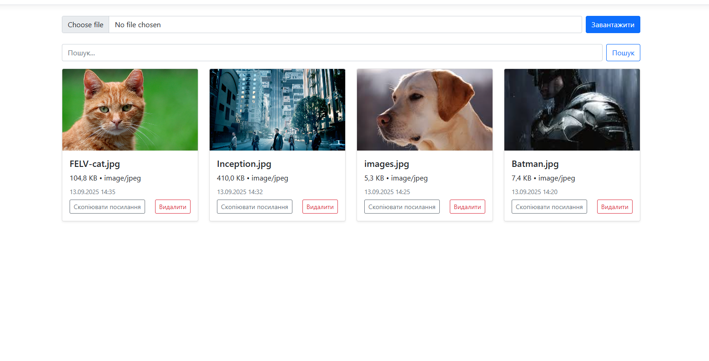

# ASP.NET + Azure Photo Management Application

This is a web application built using ASP.NET and Azure services, designed for managing images. It allows users to upload, view, delete, and manage images easily. The application is integrated with Azure Blob Storage and Azure Storage Services for efficient and secure file handling.

## Features

- **Upload Photos**: Easily upload images using the file input field.
- **View Photos**: The uploaded images are displayed in a gallery format, showing file names and sizes.
- **Delete Photos**: Users can delete images with a single click, removing them from both the application and the Azure Blob Storage.
- **Azure Blob Storage Integration**: All uploaded images are stored securely in Azure Blob Storage.
- **Azure Storage Services**: Utilizes Azure's robust storage capabilities for reliable and scalable file management.

## Technologies Used

- **ASP.NET**: Used to build the backend of the application.
- **Azure Blob Storage**: Stores and serves the images in a secure and scalable environment.
- **Azure Storage Services**: For managing file operations such as upload and delete.

## How to Use

1. **Upload**: Click on the "Choose file" button to select an image file from your device.
2. **View**: The uploaded image will appear in the gallery below, with details like file name, size, and image preview.
3. **Delete**: To remove an image, click the "Delete" button next to the image. The image will be deleted from both the application and Azure Blob Storage.

## Setup Instructions

1. Clone the repository to your local machine.
2. Set up the Azure Blob Storage account and configure the connection string in the application settings.
3. Run the application using Visual Studio or the .NET CLI.

## Contributing

Feel free to fork the repository and submit pull requests. Ensure that you follow best practices for coding standards and test your changes thoroughly.

## License

This project is licensed under the MIT License.
